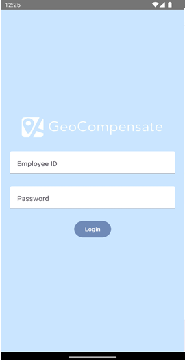
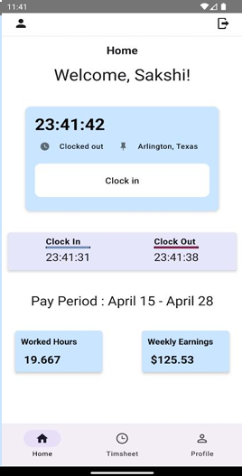
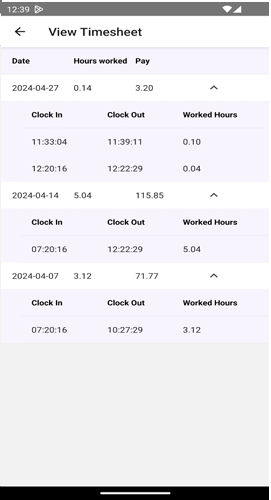

# GeoCompensate
=> GeoCompensate addresses the challenges businesses face in managing their mobile workforce efficiently by providing an innovative solution that seamlessly integrates cutting-edge GPS technology with automated payroll processes. The app aims to solve the problem of manual errors and inefficiencies in traditional payroll management. By automating payroll calculations based on real-time GPS data, GeoCompensate ensures unparalleled accuracy in tracking work hours, breaks, and overtime. The introduction of GeoCompensate responds directly to the need for fair and precise remuneration in varying geographical zones, allowing businesses to dynamically adjust employee compensation based on the specific locations where work is 
conducted. This app streamlines payroll operations and enhances transparency, efficiency, and accuracy, ultimately revolutionizing how businesses manage their mobile workforce.  
=> Some of the key features of the app being Clock In, Clock Out, View Timesheet which can automatically calculates the wage based on the clocked in time for the 15 days period, remove employee and password management.

# Video Link
- https://www.youtube.com/watch?v=GqKjJTQcdX8

## Project Photos
- Home screen when user opens the app for the first time
- 
  
- After employee logs into the app
- 

- View Timesheet
- 
